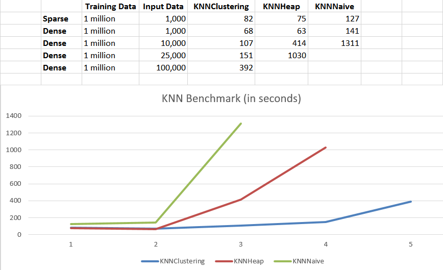
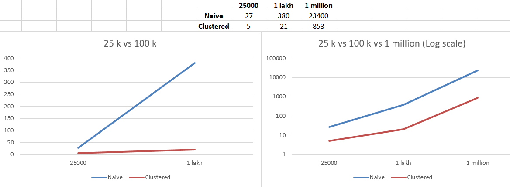

#spark-knn

k-Nearest Neighbors algorithm (k-NN) implemented on Apache Spark for Classification, Regression and Outlier Dectection. This technique uses k-Means clustering for clustering the data points, which makes the technique  much more efficient when running across multiple nodes.

## How to Use

k-NN can be used for classification, regression and outlier detection, which are exposed using the new [Spark ML](http://spark.apache.org/docs/latest/ml-guide.html) 
This implementation uses the latest DataFrame API.

### Import Package and Data

Include "spark-knn-assembly.jar" to your spark application.

```scala
import org.apache.spark.ml.classification

val training = MLUtils.loadLibSVMFile(sc, "data/mllib/sample_libsvm_training_data.txt").toDF()

val input = MLUtils.loadLibSVMFile(sc, "data/mllib/sample_libsvm_input_data.txt").toDF()
```

### KNNClassifier

```scala
//read in raw label and features
val knn = new KNNClassifier()
  		     .setK(10)

val knnModel = knn.train(training)

var output = knnModel.transform(input)

output.show()
```

### KNNRegression

```scala
//read in raw label and features
val knn = new KNNRegression()
  		      .setK(10)

val knnModel = knn.train(training)

var output = knnModel.transform(input)

output.show()
```

### KNNOutlier

```scala
//read in raw label and features
// Treshold refers to the number of in-degrees for every pointi.e., to ho wmany other points does a point occur as a k-nearest neighbour

val knn = new KNNOutlier()
             .setK(10)
             .setTreshold(3)
          
val knnModel = knn.train(training)

var output = knnModel.detect()

output.foreach(x => println(x))
```

## Benchmark

The benchmark is done using various size datasets, both sparse and dense.

The results can be seen below:

For Clustering and Regression:



For Outlier Detection:



## Special Thanks

Prof. Mohamed Y. Eltabakh

Computer Science Department, Worcester Polytechnic Institute
